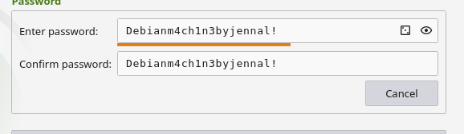

# x) Read and summarize

## € Schneier 2015: Applied Cryptography: Chapter 1: Foundations:
- Expalining the basic consepts of terminology like "sender" and "receiver", "plaintext" etc.
- The process of encryption to decryption: Message (plaintext or cleartext) being turned into something that changes its substance to hide it - this is called encryption. This hidden text is called ciphertext. The act of turning ciphertext back to normal is called decryption. 
- The act and science behind keeping messages secure is called cryptography
  
## Karvinen 2023: PGP - Send Encrypted and Signed Message - gpg
- The proocess from plaintext to back to plaintext (encrypting, ciphertext and decryption)
- Creating and understanding a keypair. Also the difference between public key and private key - their names are pretty self-explanatory.
- The whole process is done visually compherehsive with visible commands etc.

# Install OpenSSH server, connect to it using 'ssh' client

# Password manager
I chose KeePassxc on my Linux:

Why you should use a password manager?
- People tend to forget their passwords - complex or simple ones
- A manager minimizes the chances of people using the same passwords. Using the same passwords is bad, since after a person knows one of your passwords, they have access to multiple platforms you used the same password for.
- Keeping your devices in sync - the same password can be autofilled in with all your devices.
- Warnings - if your password has been leaked the manager will send you a warning message

# d) Pretty Good indeed. Encrypt and decrypt a message with 'gnupg', using PGP public key cryptography

# References:

https://terokarvinen.com/2023/pgp-encrypt-sign-verify/

https://learning.oreilly.com/library/view/applied-cryptography-protocols/9781119096726/08_chap01.html#chap01-sec006

https://keepassxc.org

https://www.ncsc.gov.uk/collection/top-tips-for-staying-secure-online/password-managers

