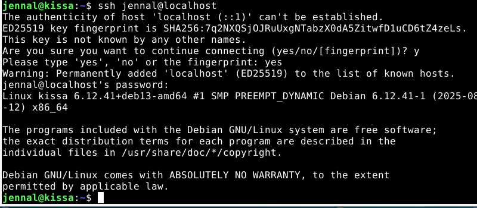

# x) Read and summarize

##  Schneier 2015: Applied Cryptography: Chapter 1: Foundations:
- Expalining the basic consepts of terminology like "sender" and "receiver", "plaintext" etc.
- The process of encryption to decryption: Message (plaintext or cleartext) being turned into something that changes its substance to hide it - this is called encryption. This hidden text is called ciphertext. The act of turning ciphertext back to normal is called decryption. 
- The act and science behind keeping messages secure is called cryptography
  
## Karvinen 2023: PGP - Send Encrypted and Signed Message - gpg
- The proocess from plaintext to back to plaintext (encrypting, ciphertext and decryption)
- Creating and understanding a keypair. Also the difference between public key and private key - their names are pretty self-explanatory.
- The whole process is done visually compherehsive with visible commands etc.

# Install OpenSSH server, connect to it using 'ssh' client

- Here are some pictures of the steps I took, I might have missed something - I was a bit confused by the instructions but here's what I managed to get done!

- Updated the Linux with "sudo apt-get update"
- "sudo apt-get install ssh"
- Typed in the whoami command

- Gave the command jennal@localhost
  

- I exited the ssh after giving my password and giving the command ssh jennal@localhost

Here's the ssh key-gen command and what happened when I used it:

# Password manager
I chose KeePassxc on my Linux
- I installed KeePassxc by "sudo apt install keepassxc"
- And then after it installed I opened my applications folder and opened KeePassxc

- Safely store your passwords in this passwords manager - I saved the application to a folder on my Linux so it's easy to find
- I can sync these passwords with my other devices if I wanted to
- I can generate strong passwords for my accounts on websites etc

Why you should use a password manager?
- People tend to forget their passwords - complex or simple ones
- A manager minimizes the chances of people using the same passwords. Using the same passwords is bad, since after a person knows one of your passwords, they have access to multiple platforms you used the same password for.
- Keeping your devices in sync - the same password can be autofilled in with all your devices.
- Warnings - if your password has been leaked the manager will send you a warning message

# s) ETAOIN
The encrypted text: HDMH'B TH. KWU'YI AWR WSSTOTMJJK M OWQINYIMLIY! MB KWU BII, BTGPJI BUNBHTHUHTWA OTPDIYB OMA NI NYWLIA RTHD SYIEUIAOK MAMJKBTB. BII KWU MH DHHP://HIYWLMYCTAIA.OWG

- The first thing I noticed was the ending: "DHHP://HIYWLMYCTAIA.OWG" which I assumed could mean something like "HTTP://_______.COM" so that already made decryphering this easier, since I assumed D = H, H = T, P = P, O = C, W = O and G = M, that being said the beginning of the text would be: TH_T'_ _T. which already makes a lot more sense. I assumed it said "That's it." so I applied those letters to my list of known letters.

- The text now starts: THAT'S IT. _O_'__ _O_ O__ICIA___ A CO_____A___!
- I stopped there, since I once again made some assumtions, I think it says: That's it. You're now officially a (something). Let's apply these letters to the list (full list is in the end of the assignment to save space)

- The text now is: THAT'S IT. YOU'RE NOW OFFICIALLY A CO_E_REA_ER. I thought at first it said CODEREADER, but that doesn't add up.I do think it has something do with coding, so I assume Q = D.
- Let's see the whole text now:
- THAT'S IT. YOU'RE NOW OFFICIALLY A CODE_REA_EIR! AS YOU SEE, SIMPLE SU_STITUTION CIPHERS CAN _E _RO_EN WITH FRE_UENCY ANALYSIS, SEE YOU AT HTTP://TERO_AR_INEN.COM

- I think it's pretty safe to assume the whole text: THAT'S IT. YOU'RE NOW OFFICIALLY A CODEBREAKER! AS YOU SEE, SIMPLE SUBSTITUTION CIPHERS CAN BE BROKEN WITH FREQUENCY ANALYSIS, SEE YOU AT HTTP://TEROKARVINEN.COM

### The full list of alphabets used in the cypher and the "real" letters:

D = H

H = T

P = P

O = C

W = O

G = M

M = A

B = S

T = I

K = Y

U = U

Y = R

I = E

A = N

R = W

S = F

J = L

Q = D

N = B

L = K

E = Q

C = V

# References:

https://terokarvinen.com/2023/pgp-encrypt-sign-verify/

https://learning.oreilly.com/library/view/applied-cryptography-protocols/9781119096726/08_chap01.html#chap01-sec006

https://keepassxc.org

https://www.ncsc.gov.uk/collection/top-tips-for-staying-secure-online/password-managers

https://en.wikipedia.org/wiki/Frequency_analysis

