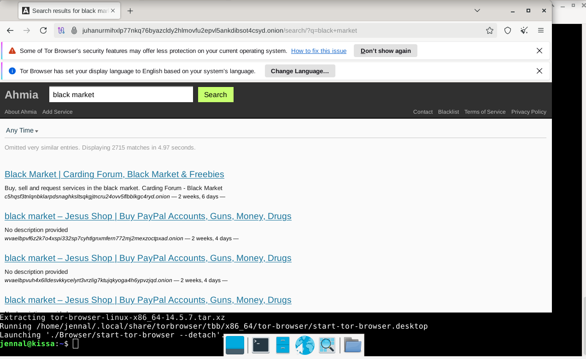
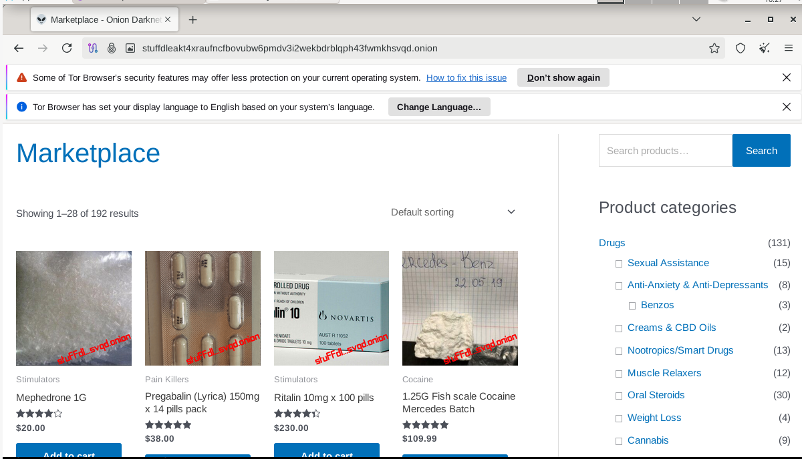
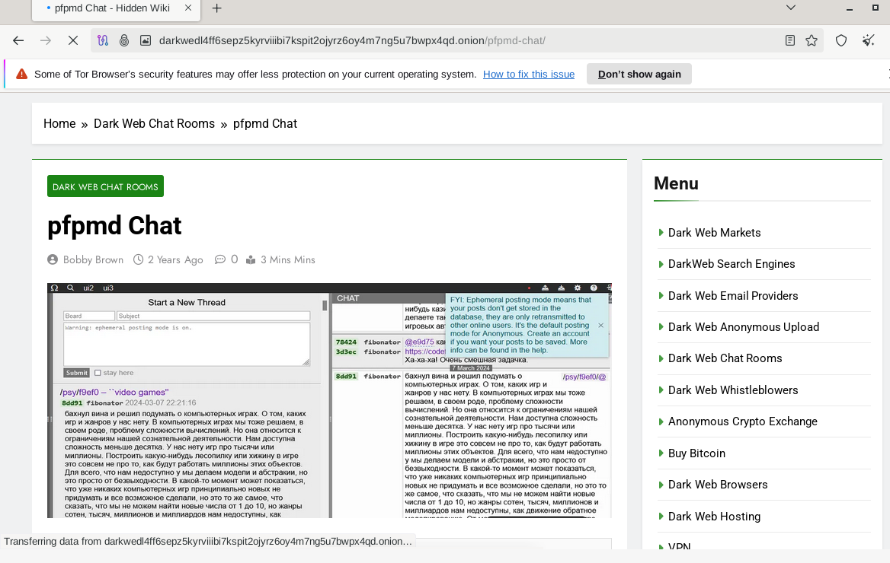
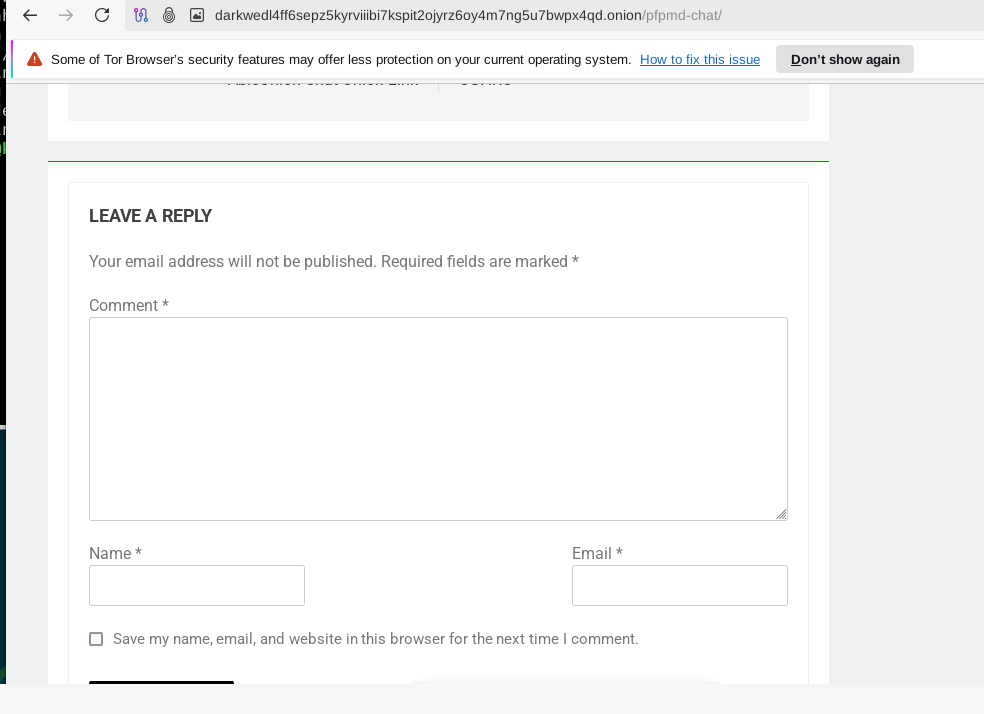
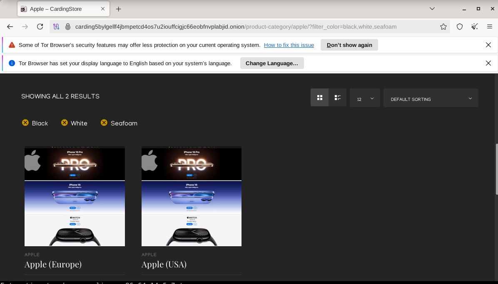

## x) Read and summarize 

Quintin 2014: 7 Things You Should Know About Tor:
- TOR is used by all kinds of people - the misconception is that it is only used by criminals or to do illegal things - this is not all true.
- TOR is easy to use and works better than people think, it's not as slow as people make it out to be and the developers are actively working on building it faster.
- It's not a bulletproof way to be absolutely safe online, you can risk your identity if you don't use it correctly.
- Remember to keep your software up to date and to be mindful that your identity is being watched if you sign into Google, etc. 

Shavers & Bair 2016: Hiding Behind the Keyboard: The Tor Browser 

Introduction: 
- Book informs the reader how to learn to stay safe and to distinguish different means of communication.
- technology makes means of communication faster, more efficient and more secure than before - this however can be used for evil, therefore we must stay vigilant and keep an investigative mindset.

History and Intended Use of The Onion Router: 
- TOR is used by whistleblowers, businesses and people who wish to communicate anonymously and safely. It is also used to commit crimes.
- Even though it was developed by US officials it's not controlled by them, it is kind of controlled by everyone because it's open for improvement from all over the world, giving it worldwide input from experts who make sure it stays effective.

How The Onion Router Works:
- TOR works by directing the user's internet traffic through relays
- Each relay encrypts the data and sends it forward
- The onion router works like an onion - where with each relay, one layer is being "peeled off"

Tracking Criminals Using TOR: 
- Government agencies use TOR to track down the criminals using it for illegal things, but it's quite difficult
- The TOR's biggest weakness is its users - for example if you want to keep your identity hidden, you should never reply "allow" to questions like "Allow your location to be shared?" etc.
- Also downloading plugins which allow true IP addresses to be collected can risk your identity
- Ross Ulbricht using his own e-mail address on the surface internet, which officials linked to his dark web business landed him in jail for the rest of his life (Silk Road incident)
- Commonly, simple mistakes by the users are the criminating ones that lead to criminals being caught - a suspect could mistakenly use a non-Tor browser and not realize it while the investigators will receive the true IP address

## Install TOR browser and access TOR network (.onion addresses)
- Installed TOR using commands:
- sudo apt-get update
- sudo apt-get install torbrowser-launcher

- Launched it using tor-browser launcher

## b) Browse TOR network, find, take screenshots and comment

### Search engine for onion sites

I used Ahmia
  

### marketplace

### Forum

### A site for a well known organization that has a physical street address in the real world

## References:
- https://www.eff.org/deeplinks/2014/07/7-things-you-should-know-about-tor
- https://learning.oreilly.com/library/view/hiding-behind-the/9780128033524/XHTML/B9780128033401000021/B9780128033401000021.xhtml#s0010
- https://terokarvinen.com/information-security/#h5-uryyb-greb
